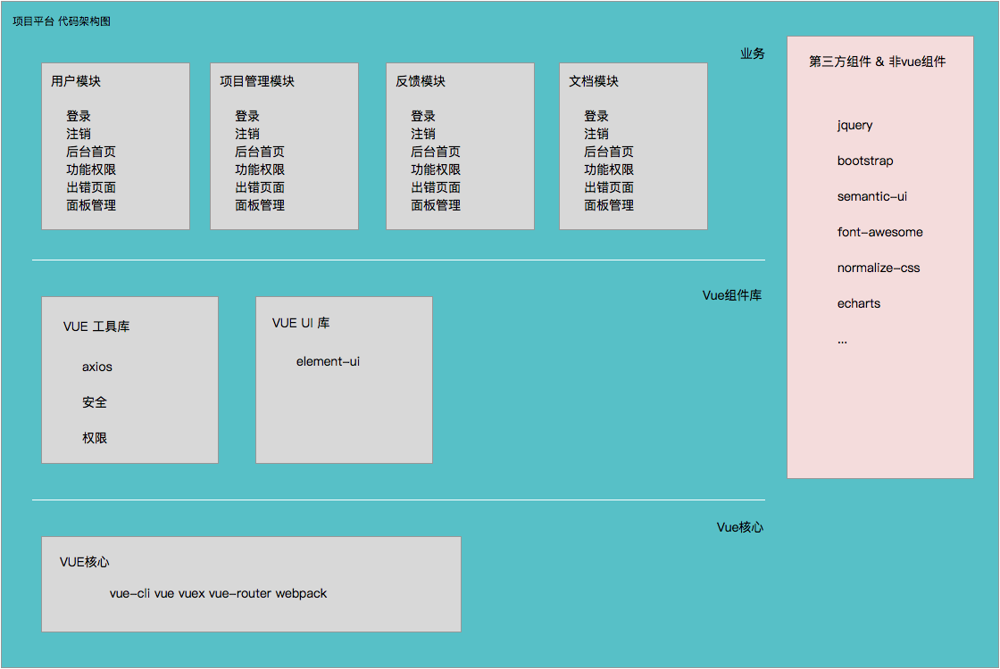

# 01-代码结构

> 同层不要互相依赖

## 业务层

> 直接与用户交互

- 模块表

模块 | 功能 | 说明
-----|------|----
后台面板 | 登录       | 管理员提供登录账号&初始密码
        | 注销       | 清除各种用户登录后的缓存配置
        | 后台首页    | 菜单、导航、内容区、模块切换
        | 修改密码    | 原密码、新密码、确认新密码
        | 面板管理    | 自适应、拖放、调整大小、动态载入、动态内容
        | 错误页     | 404、500、业务错误，系统错误跳转单独页，默认tip方式提示
项目管理 | 计划       | 列表、新建
        | 项目       | 新建项目
        | 任务       | 新建任务、新建子任务
        | 实施       | 更新项目动态
        | 反馈       | 新建反馈信息、反馈处理
网盘管理  | 文件列表   | 列表模式、大图模式、下载、删除、重命名

> 管理层次： 计划 -》项目 -》任务 -》子任务 -》实施 -》 反馈

> 课程层次： 课程名称 -》课程模块 -》 模块内容（天）

## Vue组件层

- 工具库

模块 | 说明
----|------------
config       | 项目运行配置
httpClient   | http通讯, 支持 `RESTful API` 风格
localStore   | 本地数据持久化支持
securt       | 签名、哈希、MD5、对称加密、随机字符串(16 32 位)
acl          | 权限检查：资源、操作

- UI组件

模块 | 说明
----|------------
iview         | ui库比较丰富
element-ui    | 饿了么界面库（可选）

## Vue核心层

模块 | 说明
----|------------
vue2         | vue2库
vue-cli      | 官方cli
vuex         | 状态管理
vue-router   | 路由
vue-template | 模板
webpack2     | 发布打包
babel-loader | es6编译

## 第三方组件 & 非Vue

模块 | 说明
----|------------
jquery2       | jquery2
bootstrap3    | bootstrap3 css js
font-awesome  | 字体库
normalize-css | css rest
semantic-ui   | semantic界面库
